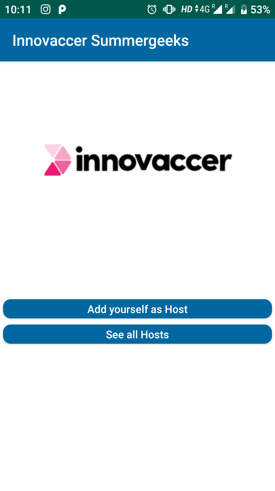
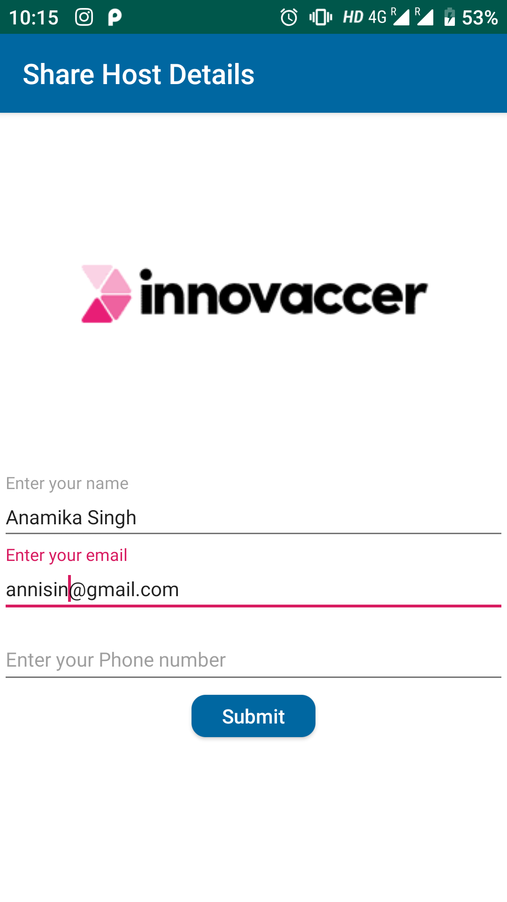
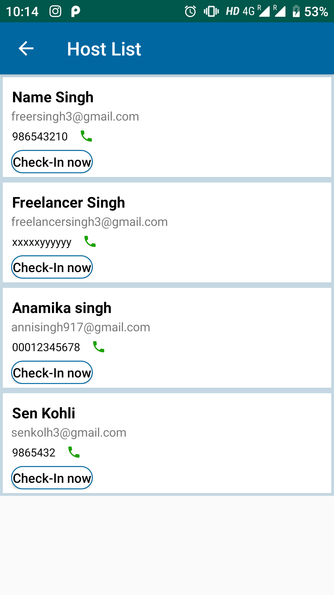
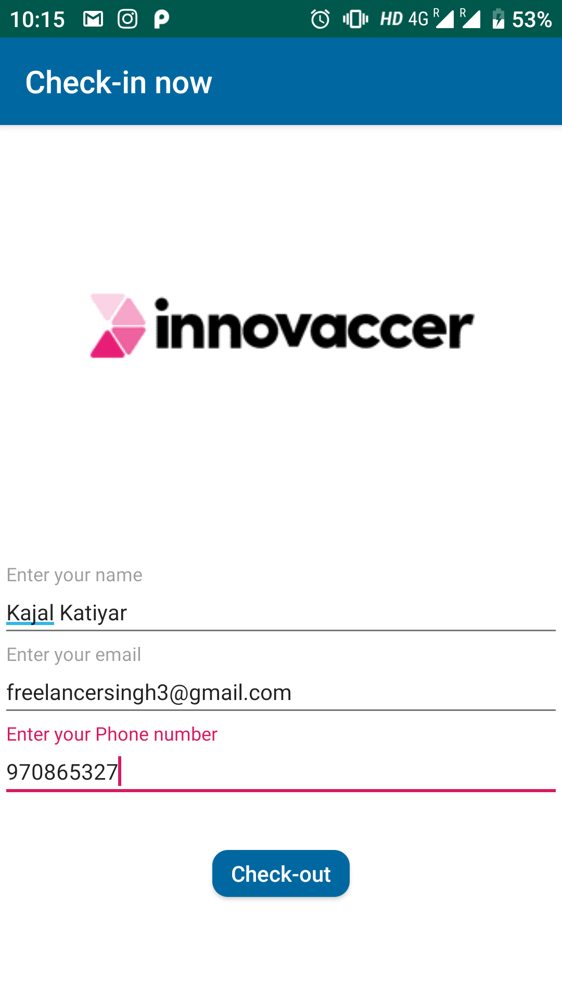
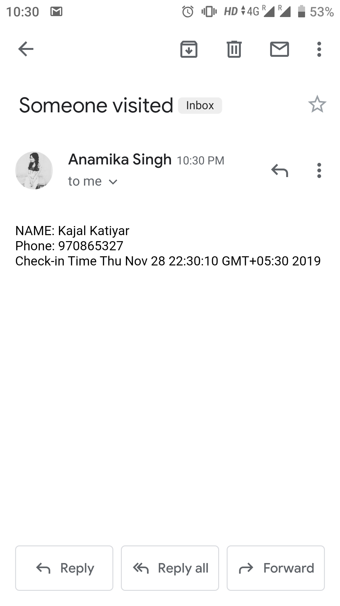
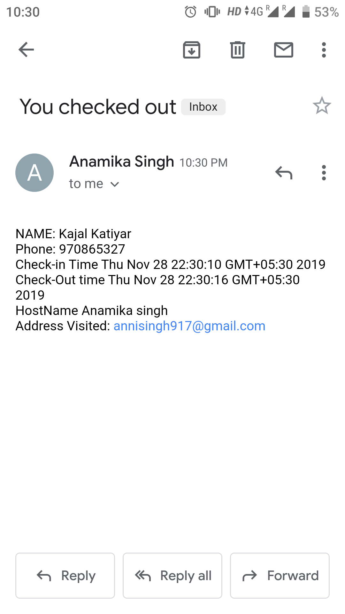

# innovaccerSummergeek2020

Select one of these 
- Add yourself to host: to add yourself as Host in the Application
- See All Hosts : see the hosts details who have registered before 
<html>
</html>

Add Host Details here: 

<html>
</html>

We can view previously added Host/also select host for check-in 

<html>
</html>

when you(visitor) presses on check in:
it sends an Email-intent which sends this email to the HOST(Check-in from here by adding your details)

<html>
</html>

Email:
<html>
</html>

when you(visitor) presses on check-out button :
it sends an Email-intent which sends this email to the VISITOR(Email)

<html>
</html>

->Here I have used Firebase to Add data and store data of Host and Vitors
->Timestamp to fetch check-in and check-out price 
-> Email intent to send emails

